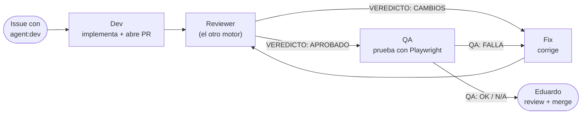

Un issue viaja por hasta cuatro agentes antes de llegar a vos. Cada paso lo dispara un **label** que pone el
dispatcher al terminar el anterior; vos solo ponés el primero.

## El camino feliz

1. Ponés `agent:dev` en un issue del repo. El **dev** (Codex por defecto; `engine:claude` lo cambia) lo implementa
   con TDD, en una rama `agent/<issue>-<slug>`, y abre un PR con `Closes #<issue>`.
2. El dispatcher le pone `agent:review` al PR. El **reviewer** —siempre el otro motor del dev— lee el issue, el
   diff y el CI, y publica un comentario con `VEREDICTO: APROBADO` o `VEREDICTO: CAMBIOS`.
3. Si es `APROBADO`, el dispatcher le pone `agent:qa`. El **QA** (Codex por defecto) corre la app con Playwright,
   sigue un plan de prueba numerado por cada criterio de aceptación, sube capturas a la rama `qa-evidence` y
   publica `QA: OK`, `QA: FALLA` o `QA: N/A` (si el PR no tiene cambios visibles).
4. Si es `QA: OK` o `QA: N/A`, el dispatcher te pide la review del PR. Vos apruebas y mergeás: `main` está protegida
   y solo una persona puede hacerlo.

## Fix: cuando algo vuelve

El **fix** es el mismo rol de dev, pero atendiendo comentarios en vez de arrancar de cero. Lo dispara:

- `VEREDICTO: CAMBIOS` del reviewer, o `QA: FALLA` del QA — el dispatcher le pone `agent:fix` al PR.
- Un comentario `@openhands ...` tuyo en el issue o el PR (no en comentarios sobre líneas de código).

El fix corrige con TDD los puntos **bloqueantes** (las sugerencias, solo si son baratas), nunca descarta
funcionalidad que ya existe en `main`, hace commit y push a la misma rama. Después de un fix por label vuelve a
pasar por **review** (una corrección puede introducir un problema nuevo); después de un fix por tu comentario
vuelve directo a **tu** review, porque fuiste vos quien lo pidió.

Hay un tope de **2 rondas automáticas** de cambios y de QA. Si se agota, el dispatcher pone `needs:human` y te pide
una decisión.

## Conflictos automáticos

Si un PR queda con conflictos contra `main` (por ejemplo, porque se mergeó otro PR antes), el dispatcher no espera
a que lo notes: arranca una tarea de **fix** con la instrucción de resolverlos. La regla es estricta: **nunca se
puede descartar funcionalidad que ya está en `main`** para resolver un conflicto; si no se puede combinar ambos
lados sin perder algo, el agente tiene que parar, explicar el problema y poner `needs:human`. Después de resolver
conflictos, el PR **vuelve a pasar por review** antes de QA, porque una resolución mal hecha puede desconectar algo
sin que el CI lo note (así se descubrió una regresión real durante el piloto). Hay un tope de 2 intentos antes de
escalar a `needs:human`.

## Dependencias entre issues

Si un issue necesita el código de otro, escribís una línea `Depende de #N` en su cuerpo (el template de issue ya
tiene esa sección). El dispatcher no lo arranca hasta que el issue `#N` se cierre, y te avisa con un comentario la
primera vez que lo detecta. Podés forzar que arranque igual comentando con `@openhands`.

## Siguiente paso

Para saber exactamente qué hace cada rol, con qué motor y qué **no** hace, seguí con [Roles](/ai-dev-team/guia/roles/).
