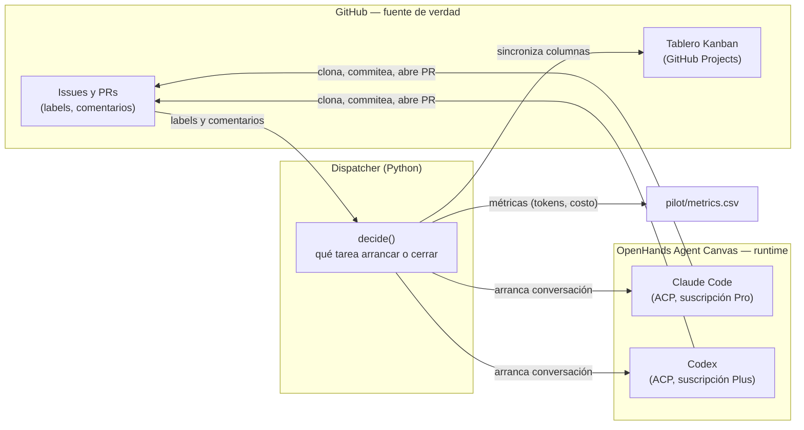

**AI Dev Team** es un equipo de agentes de IA que trabaja sobre los repos de `maxiar-org`: toma issues etiquetados,
implementa con TDD, abre un PR, lo revisa otro agente (con otro modelo), lo prueba un agente de QA y finalmente te
pide la aprobación a vos. El código lo escriben los agentes; mergear a `main` siempre lo decide una persona.

## Objetivo

Que un equipo de agentes pueda entregar software de forma **autónoma** (sin que una persona escriba código),
**sostenible** (dentro de suscripciones, no pago por uso) y con **entregables visibles** (una app que corre, no solo
un diff). Nació como un piloto de un fin de semana sobre un proyecto real ([`qr-generator`](https://github.com/maxiar-org/qr-generator))
y pasó a una fase de equipo con más roles y más proyectos. El resumen de ese piloto está en
[Lecciones del piloto](/ai-dev-team/piloto/lecciones/).

## Arquitectura

Hay tres piezas, cada una con una responsabilidad clara:

- **OpenHands Agent Canvas** es el *runtime* de los agentes: ejecuta las conversaciones por ACP (Agent Client
  Protocol) con Claude Code y Codex, usando las suscripciones Pro/Plus en lugar de pago por uso, les da un entorno de
  trabajo (clona el repo, corre `git` y `gh`) y expone sus métricas de tokens y costo.
- **El dispatcher** (Python, en `dispatcher/`) es el orquestador propio del equipo. No ejecuta modelos ni tiene
  lógica de IA: en cada ciclo (cada `POLL_SECONDS`) lee el estado de GitHub y de Canvas, **decide** qué tarea
  arrancar o cerrar según labels, comentarios y veredictos, y aplica el resultado de vuelta en GitHub (labels,
  comentarios, pedidos de review) y en el tablero Kanban.
- **GitHub es la fuente de verdad.** No hay una base de datos de tareas: el estado de cada issue y PR —labels,
  comentarios, si tiene conflictos, si está mergeado— **es** el estado del equipo. El dispatcher guarda en
  `state.json` solo lo que GitHub no modela (qué conversación de Canvas corresponde a qué tarea), para poder
  recuperarse si se reinicia.

Algunas decisiones de arquitectura, documentadas con más detalle en la bitácora del piloto
(`docs/bitacora.md`, fuera del sidebar):

- **La orquestación es propia**, no de OpenHands: Canvas se usa solo como ejecución, entorno y métricas. Esto da
  control total sobre el flujo (roles, rondas, conflictos, dependencias) sin depender de lo que ofrezca el producto.
- **Dos motores, uno revisa al otro.** El dev y el reviewer de un mismo PR siempre usan modelos distintos
  (`other_engine` en el dispatcher), para que la revisión no sea el mismo modelo validándose a sí mismo.
- **OpenHands Cloud Individual se descartó** por ahora: tiene un límite de 10 conversaciones por día y solo funciona
  con API key (pago por uso), sin las suscripciones Pro/Plus que hacen sostenible el consumo.

## Siguiente paso

Para ver cómo viaja un issue de punta a punta, seguí con [El flujo del equipo](/ai-dev-team/guia/flujo-del-equipo/).
